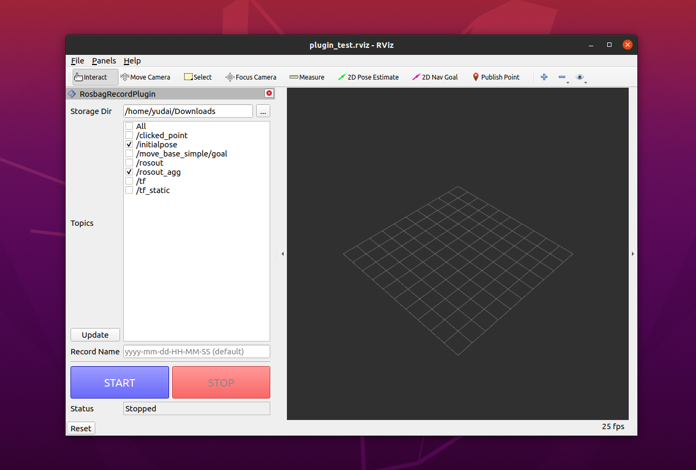
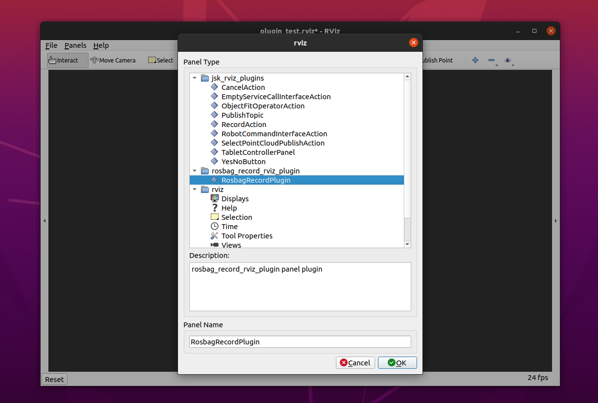

# rosbag record Rviz plugin



## Build

```
cd ~/catkin_ws
catkin_make
```

## Launch

```
cd ~/catkin_ws
source devel/setup.bash     # important!
rviz
```

Panels >> Add New Panel >> RosbagRecordPlugin >> OK



---
2023.12 yudai.yamazaki